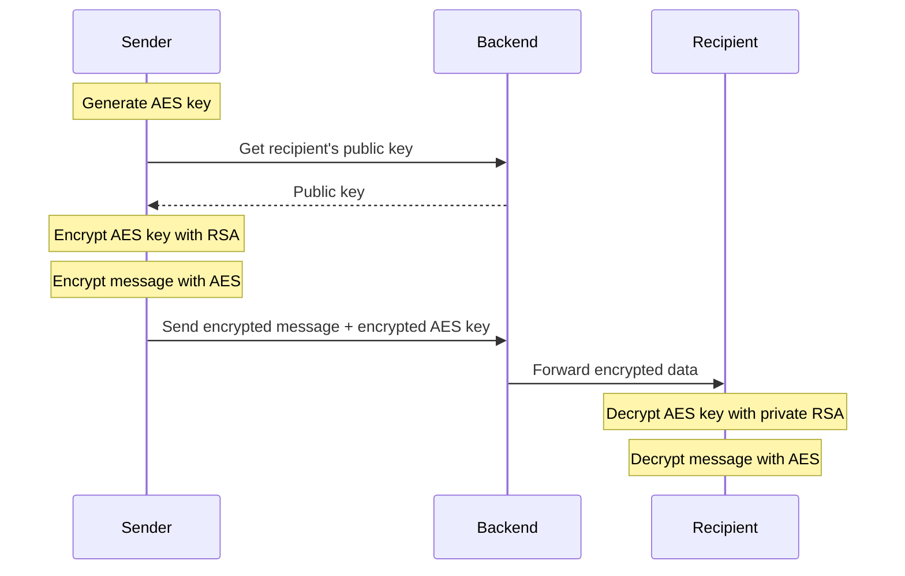

# End-to-End Encryption Implementation

This document details the end-to-end encryption (E2EE) implementation in the E2EE Chat application.

> **Related Documentation**
> - For backend implementation, see [Backend Implementation](backend_impl.md)
> - For frontend implementation, see [Frontend Implementation](frontend_impl.md)
> - For integration details, see [Integration Guide](integration.md)
> - For backend security architecture, see [Backend Description](backend_desc.md#security-considerations)

## Overview

The application uses a hybrid encryption approach:
1. **RSA** for secure key exchange
2. **AES-GCM** for message encryption
3. **Base64** for encoding binary data

## Key Components

### 1. Key Generation and Management

#### RSA Key Pair Generation
```java
private static final int RSA_KEY_SIZE = 2048;

public static KeyPair generateRSAKeyPair() throws NoSuchAlgorithmException {
    KeyPairGenerator keyGen = KeyPairGenerator.getInstance("RSA");
    keyGen.initialize(RSA_KEY_SIZE);
    return keyGen.generateKeyPair();
}
```

#### AES Key Generation
```java
private static final int AES_KEY_SIZE = 256;

public static SecretKey generateAESKey() throws NoSuchAlgorithmException {
    KeyGenerator keyGen = KeyGenerator.getInstance("AES");
    keyGen.init(AES_KEY_SIZE);
    return keyGen.generateKey();
}
```

### 2. Message Encryption Flow



## Implementation Details

### 1. Key Storage

- **Private Key**: Never leaves the client device
- **Public Key**: Stored in user profile
- **Session Keys**: Temporary AES keys for each chat session

### 2. Message Encryption Process

```java
public class MessageEncryption {
    // Encrypt message for a recipient
    public static EncryptedMessage encryptMessage(
            String message, 
            PublicKey recipientPublicKey
    ) throws Exception {
        // Generate new AES key for this message
        SecretKey aesKey = generateAESKey();
        
        // Encrypt the message with AES
        String encryptedContent = encryptWithAES(message, aesKey);
        
        // Encrypt the AES key with recipient's public key
        String encryptedKey = encryptAESKey(aesKey, recipientPublicKey);
        
        return new EncryptedMessage(encryptedContent, encryptedKey);
    }
    
    // Decrypt message using private key
    public static String decryptMessage(
            EncryptedMessage message, 
            PrivateKey privateKey
    ) throws Exception {
        // Decrypt the AES key
        SecretKey aesKey = decryptAESKey(message.getEncryptedKey(), privateKey);
        
        // Decrypt the message content
        return decryptWithAES(message.getEncryptedContent(), aesKey);
    }
}
```

### 3. AES-GCM Implementation

```java
public class AESEncryption {
    private static final String AES_ALGORITHM = "AES/GCM/NoPadding";
    private static final int GCM_IV_LENGTH = 12;
    private static final int GCM_TAG_LENGTH = 128;

    public static String encrypt(String plaintext, SecretKey key) throws Exception {
        // Generate random IV
        byte[] iv = new byte[GCM_IV_LENGTH];
        SecureRandom random = new SecureRandom();
        random.nextBytes(iv);

        // Initialize cipher
        Cipher cipher = Cipher.getInstance(AES_ALGORITHM);
        GCMParameterSpec spec = new GCMParameterSpec(GCM_TAG_LENGTH, iv);
        cipher.init(Cipher.ENCRYPT_MODE, key, spec);

        // Encrypt
        byte[] ciphertext = cipher.doFinal(plaintext.getBytes(StandardCharsets.UTF_8));

        // Combine IV and ciphertext
        ByteBuffer byteBuffer = ByteBuffer.allocate(iv.length + ciphertext.length);
        byteBuffer.put(iv);
        byteBuffer.put(ciphertext);

        // Encode as Base64
        return Base64.getEncoder().encodeToString(byteBuffer.array());
    }

    public static String decrypt(String encrypted, SecretKey key) throws Exception {
        // Decode from Base64
        byte[] decoded = Base64.getDecoder().decode(encrypted);
        ByteBuffer byteBuffer = ByteBuffer.wrap(decoded);

        // Extract IV
        byte[] iv = new byte[GCM_IV_LENGTH];
        byteBuffer.get(iv);

        // Extract ciphertext
        byte[] ciphertext = new byte[byteBuffer.remaining()];
        byteBuffer.get(ciphertext);

        // Initialize cipher
        Cipher cipher = Cipher.getInstance(AES_ALGORITHM);
        GCMParameterSpec spec = new GCMParameterSpec(GCM_TAG_LENGTH, iv);
        cipher.init(Cipher.DECRYPT_MODE, key, spec);

        // Decrypt
        byte[] plaintext = cipher.doFinal(ciphertext);
        return new String(plaintext, StandardCharsets.UTF_8);
    }
}
```

## Security Considerations

### 1. Key Generation
- Use cryptographically secure random number generator
- Adequate key sizes (RSA: 2048 bits, AES: 256 bits)
- Fresh AES key for each message

### 2. Message Security
- Authenticated encryption (AES-GCM)
- Integrity protection
- Forward secrecy through session keys
- Replay attack prevention

```java
public class SecurityMeasures {
    // Prevent replay attacks
    private static Set<String> usedNonces = Collections.synchronizedSet(new HashSet<>());
    
    public static boolean isValidNonce(String nonce) {
        if (usedNonces.contains(nonce)) {
            return false;
        }
        usedNonces.add(nonce);
        return true;
    }
    
    // Validate key strength
    public static boolean isValidKeyStrength(Key key) {
        if (key instanceof RSAKey) {
            return ((RSAKey) key).getModulus().bitLength() >= 2048;
        } else if (key instanceof SecretKey) {
            return key.getEncoded().length * 8 >= 256;
        }
        return false;
    }
}
```

### 3. Key Rotation
- Regular public/private key rotation
- Session key expiration
- Secure key deletion

## Error Handling

```java
public class EncryptionErrorHandler {
    public static void handleEncryptionError(Exception e) {
        if (e instanceof InvalidKeyException) {
            // Handle invalid key (wrong key size, corrupt key, etc.)
        } else if (e instanceof BadPaddingException) {
            // Handle decryption failure
        } else if (e instanceof AEADBadTagException) {
            // Handle message tampering
        }
    }
}
```

## Best Practices

1. **Key Management**
   - Secure key generation
   - Safe key storage
   - Regular key rotation
   - Secure key deletion

2. **Message Security**
   - Unique IV for each encryption
   - Authentication of encrypted data
   - Protection against known attacks

3. **Implementation Security**
   - No debug logging of sensitive data
   - Secure memory handling
   - Input validation

## Testing

### 1. Unit Tests

```java
public class EncryptionTests {
    @Test
    public void testMessageEncryption() {
        // Generate keys
        KeyPair keyPair = CryptoUtils.generateKeyPair();
        String message = "Test message";
        
        // Encrypt
        EncryptedMessage encrypted = MessageEncryption.encryptMessage(
            message, keyPair.getPublic()
        );
        
        // Decrypt
        String decrypted = MessageEncryption.decryptMessage(
            encrypted, keyPair.getPrivate()
        );
        
        assertEquals(message, decrypted);
    }
}
```

### 2. Security Tests

```java
public class SecurityTests {
    @Test
    public void testReplayAttack() {
        String nonce = generateNonce();
        assertTrue(SecurityMeasures.isValidNonce(nonce));
        assertFalse(SecurityMeasures.isValidNonce(nonce)); // Should fail
    }
    
    @Test
    public void testMessageTampering() {
        // Encrypt message
        EncryptedMessage encrypted = // ...
        
        // Tamper with encrypted data
        byte[] tampered = tamperWith(encrypted.getEncryptedContent());
        
        // Attempt to decrypt
        assertThrows(AEADBadTagException.class, () -> {
            MessageEncryption.decryptMessage(tampered, privateKey);
        });
    }
}
```

## Performance Considerations

1. **Key Generation**
   - Generate keys asynchronously
   - Cache public keys
   - Reuse session keys when appropriate

2. **Message Processing**
   - Batch message encryption/decryption
   - Parallel processing for multiple recipients
   - Efficient memory usage

3. **Optimization**
   - Buffer management
   - Thread safety
   - Resource cleanup
