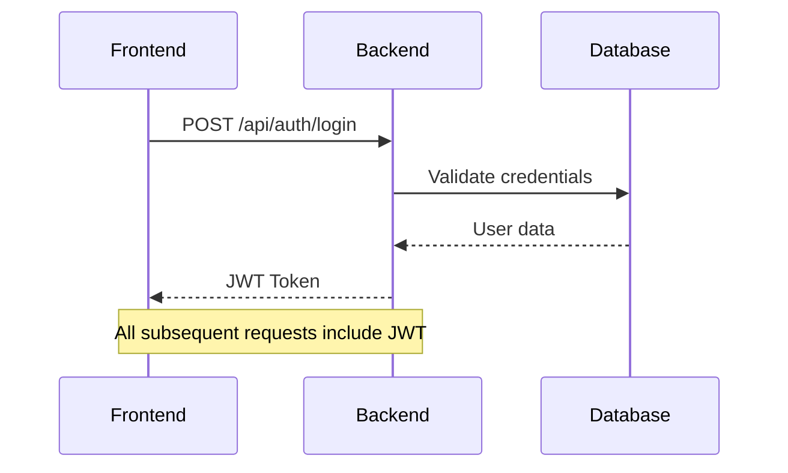
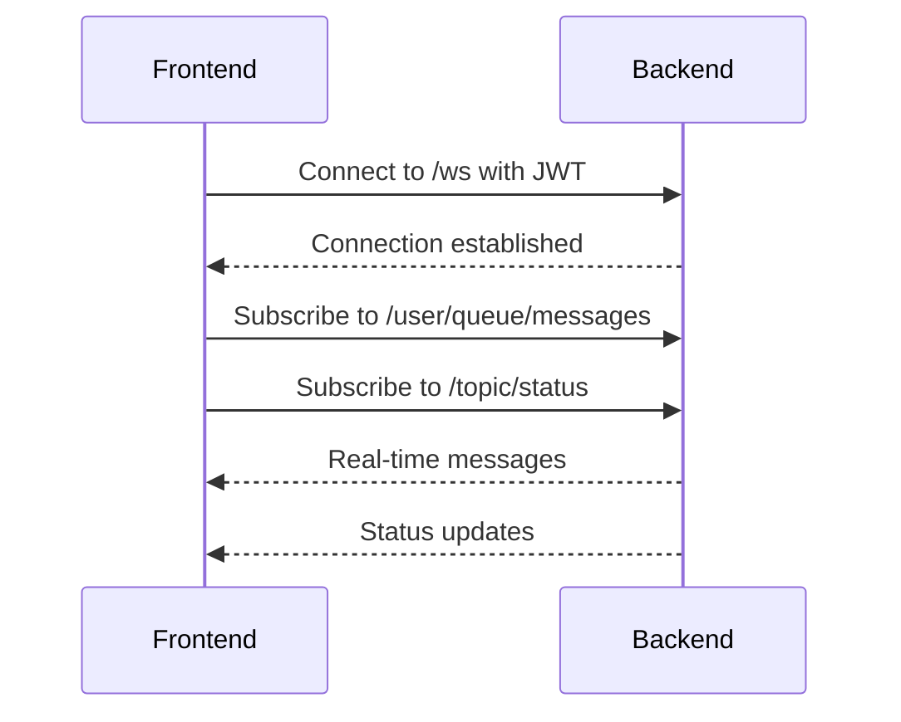
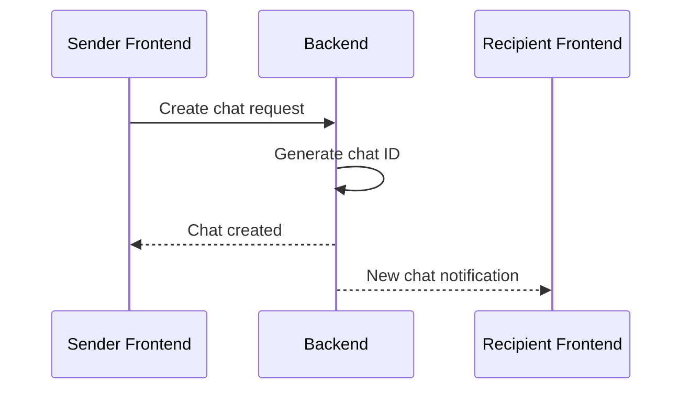
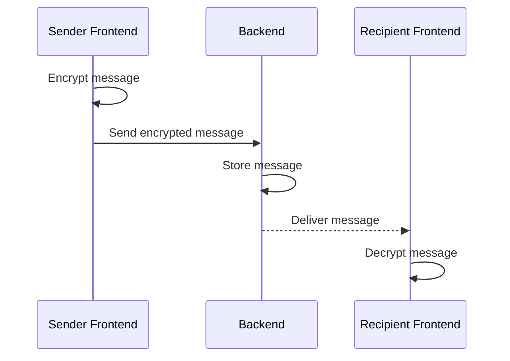

# Frontend-Backend Integration

This document describes how the JavaFX frontend and Spring Boot backend components of the E2EE Chat application are integrated and communicate with each other.

> **Related Documentation**
> - For backend details, see [Backend Implementation](backend_impl.md)
> - For frontend details, see [Frontend Implementation](frontend_impl.md)
> - For encryption handling, see [Encryption Implementation](encryption.md)
> - For architecture overview, see [Backend Description](backend_desc.md) and [Frontend Description](frontend_desc.md)

## Communication Channels

The frontend and backend communicate through two main channels:

1. **REST API** - For standard HTTP requests (authentication, profile management, etc.)
2. **WebSocket** - For real-time messaging and status updates

### REST API Integration

The frontend uses Java's `HttpClient` to make REST API calls to the backend. All API calls are authenticated using JWT tokens after login.



Key REST endpoints:
- `/api/auth/*` - Authentication and registration
- `/api/profile/*` - User profile management
- `/api/chat/*` - Chat management
- `/api/messages/*` - Message history

### WebSocket Integration

Real-time communication uses STOMP over WebSocket, providing:
- Instant message delivery
- Typing indicators
- Online status updates
- Read receipts



## Security Integration

### Authentication Flow

1. Frontend collects user credentials
2. Backend validates and returns JWT
3. Frontend stores JWT in memory
4. JWT included in all subsequent requests

### End-to-End Encryption

1. **Key Exchange**
   - Each user generates RSA key pair on frontend
   - Public key stored in user profile
   - Private key kept only in frontend memory

2. **Message Encryption**
   - Frontend encrypts messages using recipient's public key
   - Backend stores encrypted messages
   - Only recipient's frontend can decrypt

## Data Flow

### Chat Initialization


### Message Exchange


## Error Handling

1. **Network Issues**
   - Frontend implements retry mechanisms
   - WebSocket auto-reconnection
   - Message queue for offline operation

2. **Security Errors**
   - Token expiration handling
   - Encryption/decryption error recovery
   - Invalid key detection

## Implementation Details

### Frontend Integration Code

The frontend maintains service classes for API and WebSocket integration:

1. **AuthService** - Handles authentication and JWT management
2. **WebSocketService** - Manages real-time communication
3. **ChatService** - Handles chat operations
4. **MessageService** - Manages message encryption/decryption

### Backend Integration Points

The backend provides:

1. **WebSocketConfig** - Configures WebSocket endpoints
2. **SecurityConfig** - Sets up JWT authentication
3. **Controllers** - REST API endpoints
4. **WebSocketController** - Handles real-time messages

## Configuration

### Backend Configuration
```properties
# WebSocket Configuration
spring.websocket.max-text-message-size=8192
spring.websocket.max-binary-message-size=8192

# Security Configuration
jwt.expiration=86400000
```

### Frontend Configuration
```properties
# API Configuration
api.base.url=http://localhost:8080
websocket.url=ws://localhost:8080/ws

# Security Configuration
encryption.key.size=2048
message.retry.max=3
```

## Testing Integration

1. **End-to-End Tests**
   - Authentication flow
   - Message encryption/decryption
   - Real-time communication
   - Error scenarios

2. **Security Tests**
   - JWT validation
   - Encryption correctness
   - WebSocket authentication

## Common Integration Issues

1. **CORS Configuration**
   - Backend must allow frontend origin
   - WebSocket endpoints need CORS config

2. **WebSocket Timeouts**
   - Configure appropriate timeouts
   - Implement heartbeat mechanism

3. **JWT Handling**
   - Token refresh mechanism
   - Proper token storage
   - Expiration handling

4. **Encryption Synchronization**
   - Key exchange timing
   - Message ordering
   - Handling missing keys
